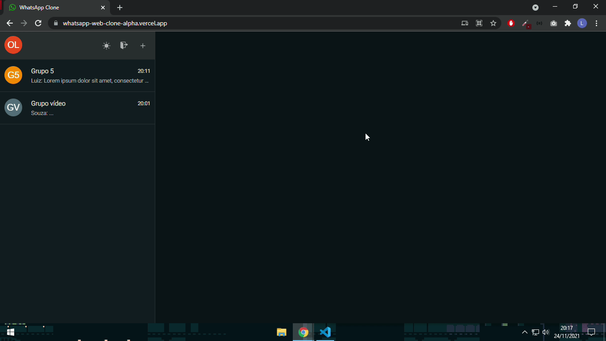

# WhatsApp Web Clone 

##### [Site URL](https://whatsapp-web-clone-alpha.vercel.app/) 

Inicialmente a ideia desse projeto era apenas reproduzir a interface do WhatsApp Web, no entanto acabei integrando-o com o Firebase o que gerou outras funcionalidades para o projeto, como autenticação com e-mail e senha ou conta Google, criação de grupos e envios de mensagens. 

 

### Funcionalidades 
- Realizar autenticação com uma conta Google 
- Realizar autenticação com e-mail e senha 
- Realizar logout 
- Alternar entre os temas dark e light 
- Criar grupos (chats) 
- Alterar informações do grupo (nome e descrição) 
- Entrar em grupos criados por outros usuários 
- Visualizar mensagens de outros usuários no grupo
- Enviar mensagens em grupos que você participa 
- Apagar mensagens que você enviou 
- Ver quais usuários participam de um grupo especifíco 
- Layout responsivo

### Tecnologias 
- Next.js 
- Firebase 
- Styled Components 
- React Icons
